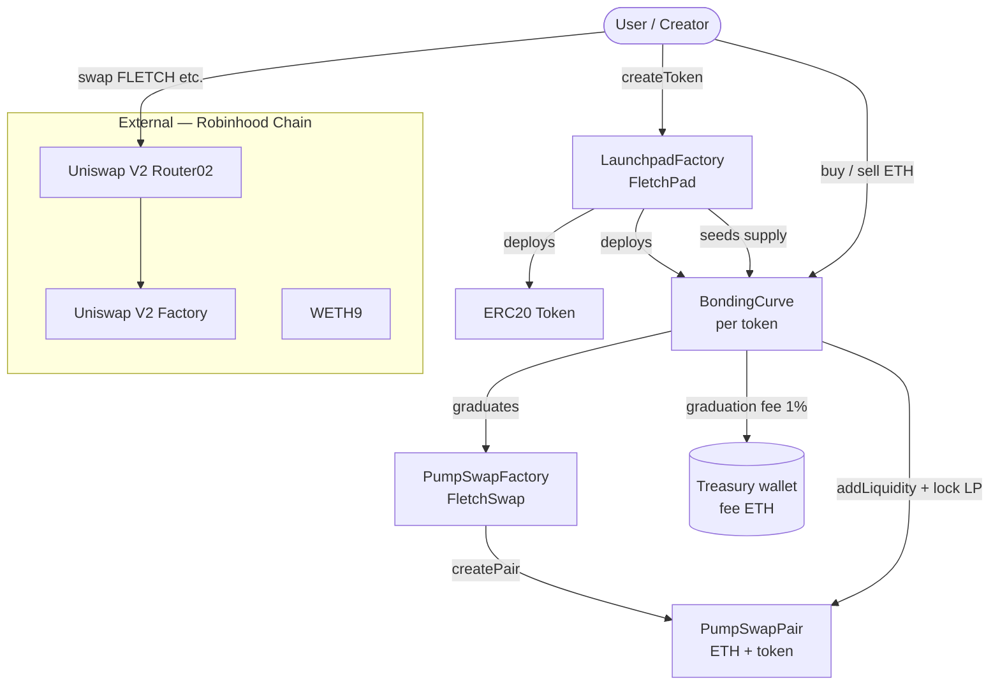

# Factory Contracts — fletch.cat / FletchPad

Reference for **which factory does what**, live mainnet addresses, and what the
frontend / integrators need to call.

**Chain:** Robinhood Chain mainnet · **chainId `4663`**  
**Explorer:** [robinhoodchain.blockscout.com](https://robinhoodchain.blockscout.com)

---

## How the factories fit together



**In plain English:**

1. **LaunchpadFactory** — entry point to **launch a new meme token** (creates
   token + bonding curve).
2. **BondingCurve** — not a factory, but each launch gets one; handles buys/sells
   until the curve is full, then **graduates**.
3. **PumpSwapFactory** — creates **ETH ↔ token pools** used when tokens graduate
   (and for manual LP, e.g. FLETCH bootstrap).
4. **Uniswap V2 (official on RH Chain)** — separate DEX; used for **$FLETCH**
   trading in the Uniswap app / aggregators. Not our contract.
5. **Our UniswapV2Factory clone** (`contracts/src/dex`) — full v2 DEX we built;
   **not deployed on mainnet yet**.

---

## Live addresses (mainnet 4663)

### Our deployed factories

| Contract | Address | Role |
|----------|---------|------|
| **LaunchpadFactory** | [`0x345f727b2C919789C991d96865505BD654d1F8F0`](https://robinhoodchain.blockscout.com/address/0x345f727b2C919789C991d96865505BD654d1F8F0) | Create new launchpad tokens |
| **PumpSwapFactory** | [`0x4B167BE628c8Bfb60FCEE215a9f3A68FC6f500B9`](https://robinhoodchain.blockscout.com/address/0x4B167BE628c8Bfb60FCEE215a9f3A68FC6f500B9) | Create FletchSwap ETH/token pairs |

### Related (not factories, but you'll need them)

| Contract | Address | Role |
|----------|---------|------|
| **FLETCH token** | [`0x60977e96F4173A81674F8D4D636d55D43377e1A7`](https://robinhoodchain.blockscout.com/address/0x60977e96F4173A81674F8D4D636d55D43377e1A7) | Platform token (Fletch Cat) |
| **FletchSwap FLETCH pair** | [`0x5635c0a6633E2c79ceB1f450DbE464FA8F0E76Ba`](https://robinhoodchain.blockscout.com/address/0x5635c0a6633E2c79ceB1f450DbE464FA8F0E76Ba) | Our AMM pool (graduation target) |
| **Treasury** (`feeRecipient`) | [`0xCFc622Af7E71C78d9e5672F4033C6225A6A36234`](https://robinhoodchain.blockscout.com/address/0xCFc622Af7E71C78d9e5672F4033C6225A6A36234) | Receives graduation fee ETH |

### External Uniswap (Robinhood Chain)

| Contract | Address | Role |
|----------|---------|------|
| **Uniswap V2 Factory** | [`0x8bceaa40b9acdfaedf85adf4ff01f5ad6517937f`](https://robinhoodchain.blockscout.com/address/0x8bceaa40b9acdfaedf85adf4ff01f5ad6517937f) | Official Uniswap pairs |
| **Uniswap V2 Router02** | [`0x89e5db8b5aa49aa85ac63f691524311aeb649eba`](https://robinhoodchain.blockscout.com/address/0x89e5db8b5aa49aa85ac63f691524311aeb649eba) | Swaps + add/remove LP via Uniswap UI |
| **WETH9** | [`0x0Bd7D308f8E1639FAb988df18A8011f41EAcAD73`](https://robinhoodchain.blockscout.com/address/0x0Bd7D308f8E1639FAb988df18A8011f41EAcAD73) | Wrapped ETH for Uniswap |
| **Uniswap FLETCH pair** | [`0x616936b685b5fca6fafB7C795aB97B8EdAd38ee5`](https://robinhoodchain.blockscout.com/address/0x616936b685b5fca6fafB7C795aB97B8EdAd38ee5) | ETH/FLETCH on Uniswap |

### Not on mainnet yet

| Contract | Source | Status |
|----------|--------|--------|
| **LaunchpadFactoryV2** | `contracts/src/v2/LaunchpadFactoryV2.sol` | Built + tested; fee model v2 — deploy with `ROUTER_ADDRESS=0x89e5… npm run deploy:v2:mainnet` |
| **UniswapV2Factory** (our clone) | `contracts/src/dex/UniswapV2Factory.sol` | Built + tested; deploy with `npm run deploy:dex:mainnet` |
| **UniswapV2Router02** (our clone) | `contracts/src/dex/UniswapV2Router02.sol` | Same |

---

## 1. LaunchpadFactory (FletchPad)

**Solidity:** `contracts/src/LaunchpadFactory.sol`  
**Product name:** FletchPad  
**Who can call:** anyone (permissionless)

### Purpose

The **launchpad entry point**. Each call to `createToken` deploys:

| Child contract | What it is |
|----------------|------------|
| `Token` | Fixed-supply ERC20 (1B default), no further minting |
| `BondingCurve` | pump.fun-style curve; holds full supply until sold |

Metadata (name, symbol, image, socials) is stored on-chain in the factory.

### What it creates (per launch)

```
createToken(...)
    ├── new Token(name, symbol, 1_000_000_000, factory)
    ├── new BondingCurve(token, PumpSwapFactory, feeRecipient, …)
    ├── transfer 100% of tokens → BondingCurve
    └── optional: dev buy if msg.value > 0
```

### Default curve economics (set at factory deploy, immutable)

| Parameter | Value | Meaning |
|-----------|-------|---------|
| Total supply | 1,000,000,000 | Per launch token |
| Sale on curve | 800,000,000 (80%) | Bought with ETH |
| Migration reserve | 200,000,000 (20%) | Seeded into FletchSwap at graduation |
| Virtual ETH (X₀) | 0.5 ETH | Curve shape |
| Virtual token (Y₀) | 1,073,000,000 | Curve shape |
| Graduation fee | **1%** (`100` bps) | Of raised ETH → treasury |

### Key functions

| Function | Caller | Description |
|----------|--------|-------------|
| `createToken(name, symbol, desc, image, twitter, telegram, website)` | anyone | `payable` — launches token + curve; optional dev buy via `msg.value` |
| `getTokens(offset, limit)` | view | Paginated token list (newest first) |
| `getToken(tokenAddress)` | view | Full metadata + curve address |
| `curveOf(token)` | view | Bonding curve for a token |
| `tokenCount()` | view | Total launches |
| `setFeeRecipient(address)` | **owner only** | Where graduation fees go |

### Events

```solidity
event TokenCreated(address indexed token, address indexed curve, address indexed creator, string name, string symbol, uint256 index);
event FeeRecipientUpdated(address indexed feeRecipient);
```

### Fee flow

- **On curve:** no per-trade platform fee (MVP).
- **On graduation:** bonding curve sends **1% of raised ETH** to `feeRecipient`
  (treasury). Remaining ETH + migration tokens seed the FletchSwap pool; LP is
  locked at `0xdead`.

---

## 2. PumpSwapFactory (FletchSwap)

**Solidity:** `contracts/src/pumpswap/PumpSwapFactory.sol`  
**Product name:** FletchSwap (AMM)  
**Who can call:** anyone for `createPair`; graduation logic also calls it

### Purpose

Deploys **one ETH ↔ ERC20 pool per token**. Pairs are `PumpSwapPair` contracts:
constant-product AMM, **0.30% swap fee** to LPs, native ETH (not WETH).

This is where **graduated launchpad tokens** trade after the curve completes.

### What it creates

```
createPair(tokenAddress)
    └── new PumpSwapPair(token)   // LP token = "PS-LP"
```

- **One pair per token** — `getPair[token]` returns `0x0` if none exists.
- Pair is created automatically on **graduation** if it doesn't exist yet.

### Key functions

| Function | Description |
|----------|-------------|
| `createPair(token)` | Deploy new ETH/token pair |
| `getPair(token)` | Pair address for token (or `0x0`) |
| `allPairs(i)` / `allPairsLength()` | Enumerate pairs |

### Events

```solidity
event PairCreated(address indexed token, address pair, uint256 index);
```

### PumpSwapPair (what the factory deploys)

Users interact with the **pair contract directly** (no separate router in MVP):

| Function | Description |
|----------|-------------|
| `addLiquidity(...)` | `payable` — add ETH + tokens |
| `removeLiquidity(...)` | Burn LP, withdraw ETH + tokens |
| `swapExactETHForTokens(minOut, to)` | `payable` — buy token with ETH |
| `swapExactTokensForETH(amountIn, minOut, to)` | Sell token for ETH |
| `getReserves()` | Current pool reserves |
| `getAmountOut(...)` | Quote helper |

**Note:** FLETCH was also bootstrapped manually via this factory
(`0x5635…` pair).

---

## 3. UniswapV2Factory (our clone — not live)

**Solidity:** `contracts/src/dex/UniswapV2Factory.sol`  
**Status:** compiled + tested in repo; **not deployed** on Robinhood mainnet

### Purpose

Full **Uniswap v2–style** factory: **token ↔ token** pairs (sorted token0/token1),
CREATE2 pair addresses, optional protocol fee switch (`feeTo` / `feeToSetter`).

Works with our `UniswapV2Router02` for multi-hop swaps and `addLiquidityETH`.

### vs PumpSwapFactory

| | PumpSwapFactory (live) | UniswapV2Factory (repo only) |
|--|------------------------|------------------------------|
| Pair type | ETH + one ERC20 | Any two ERC20s |
| Router | Calls pair directly | Dedicated Router02 |
| Used by | Launchpad graduation | Planned branded DEX |
| Mainnet | ✅ deployed | ❌ not yet |

Deploy when ready:

```bash
cd contracts
WETH_ADDRESS=0x0Bd7D308f8E1639FAb988df18A8011f41EAcAD73 npm run deploy:dex:mainnet
```

---

## 4. Official Uniswap V2 (Robinhood Chain)

Not our code — **Uniswap Labs deployment** on chain 4663. Primary public DEX on
Robinhood Chain; Uniswap app and aggregators route here.

Use **Router02** (`0x89e5…`) for swaps and liquidity — not our PumpSwap pairs.

**$FLETCH** trades here: pair `0x6169…` (ETH/WETH ↔ FLETCH).

---

## 5. LaunchpadFactoryV2 (FletchPad v2 — not live)

**Solidity:** `contracts/src/v2/LaunchpadFactoryV2.sol`  
**Status:** compiled + **25/25 tests passing** in repo; **not deployed** on mainnet  
**Graduation venue:** official Uniswap v2 Router02 on Robinhood Chain (`0x89e5…`)

### Purpose

Next-generation launchpad with **fee model v2**:

| Mechanism | Value | Notes |
|-----------|-------|-------|
| Platform token skim | **2%** of total supply | Sent to treasury on every `createToken` |
| Curve allocation | **98%** of supply | 80% sold on curve / 20% migration reserve |
| Graduation fee (start) | **5%** of raised ETH | Decays **0.5% per graduation** |
| Graduation fee (floor) | **1%** | After 8 graduations at default params |
| Fee ETH split | **70% LP / 30% treasury** | 70% of fee thickens Uniswap v2 LP depth |

### vs LaunchpadFactory (v1 live)

| | V1 (live `0x345f…`) | V2 (repo) |
|--|---------------------|-----------|
| Graduation DEX | FletchSwap (PumpSwap) | Uniswap v2 (DEXScreener-visible) |
| Platform token skim | none | 2% → treasury |
| Graduation fee | fixed 1% | 5% → 1% decaying |
| Fee use | 100% treasury | 70% back into LP, 30% treasury |
| Token list | `getTokens()` on-chain | indexer / events (no on-chain array) |

### Deploy (when wallet migration complete)

```bash
cd contracts
# .env: PRIVATE_KEY, FEE_RECIPIENT, ROUTER_ADDRESS=0x89e5db8b5aa49aa85ac63f691524311aeb649eba
npm run build && npm test
npx hardhat run scripts/deployV2.ts --network robinhood
```

Writes `deployments.v2.json` and `web/lib/launchpad-v2.<chainId>.json`.

### Key views

| Function | Description |
|----------|-------------|
| `currentGraduationFeeBps()` | Fee for the *next* token created |
| `graduationCount()` | Total graduations (drives decay) |
| `platformTokenBps()` | 200 (2%) |
| `curveOf(curve)` / `tokenOf(token)` | Address lookups |

---

## Frontend / integrator cheat sheet

What to wire for [fletch.cat](https://fletch.cat) or the reference `web/` app:

| User action | Contract to call | Address / lookup |
|-------------|------------------|------------------|
| **Create a token** | `LaunchpadFactory.createToken` | `0x345f…F8F0` |
| **Buy on curve** | `BondingCurve.buy` | `LaunchpadFactory.curveOf(token)` or `getToken` |
| **Sell on curve** | `BondingCurve.sell` | same curve address |
| **Curve progress / price** | `BondingCurve.ethReserve`, `graduationEth`, `tokensSold`, `graduated` | curve address |
| **List all tokens** | `LaunchpadFactory.getTokens(0, 100)` | factory |
| **Swap after graduation** | `PumpSwapPair.swapExactETHForTokens` / `swapExactTokensForETH` | `PumpSwapFactory.getPair(token)` |
| **Add LP (FletchSwap)** | `PumpSwapPair.addLiquidity` | pair address |
| **Swap $FLETCH (Uniswap)** | Uniswap Router02 `swapExactETHForTokens` | Router `0x89e5…`, path `[WETH, FLETCH]` |
| **Read factory config** | `LaunchpadFactory.feeRecipient`, `graduationFeeBps`, … | factory (views) |

### Env vars (frontend)

```env
NEXT_PUBLIC_CHAIN_ID=4663
NEXT_PUBLIC_LAUNCHPAD_FACTORY=0x345f727b2C919789C991d96865505BD654d1F8F0
NEXT_PUBLIC_PUMPSWAP_FACTORY=0x4B167BE628c8Bfb60FCEE215a9f3A68FC6f500B9
NEXT_PUBLIC_PLATFORM_TOKEN=0x60977e96F4173A81674F8D4D636d55D43377e1A7
NEXT_PUBLIC_PLATFORM_PAIR=0x5635c0a6633E2c79ceB1f450DbE464FA8F0E76Ba
NEXT_PUBLIC_TREASURY=0xCFc622Af7E71C78d9e5672F4033C6225A6A36234
# Optional — backend indexer for charts/trades/stats (see COORDINATION.md)
NEXT_PUBLIC_API_URL=https://your-backend.up.railway.app
# V2 only (after deploy):
# NEXT_PUBLIC_LAUNCHPAD_FACTORY_V2=0x...
```

### Backend indexer

The `backend/` service indexes `TokenCreated`, `Buy`, `Sell`, `Graduated`, and
`Swap` events. Point it at the same factory/pair addresses in `backend/.env`.

---

## Lifecycle of a launchpad token

```
1. Creator → LaunchpadFactory.createToken()
2. Traders → BondingCurve.buy() / sell()  (ETH ↔ tokens, price rises)
3. Last buy fills sale supply → auto-graduation:
      a. 1% ETH fee → treasury
      b. PumpSwapFactory.createPair() if needed
      c. Remaining ETH + 20% supply → FletchSwap LP (locked forever)
4. Traders → PumpSwapPair swaps (or Uniswap if someone adds liquidity there)
```

---

## Further reading

- [CONTRACTS.md](../CONTRACTS.md) — full launchpad + curve mechanics  
- [HANDOFF.md](../HANDOFF.md) — dev setup + all addresses  
- [TOKENOMICS.md](../TOKENOMICS.md) — $FLETCH + fee policy  
- [COORDINATION.md](../COORDINATION.md) — working with DragonmasterETH / fletch.cat prod site  
